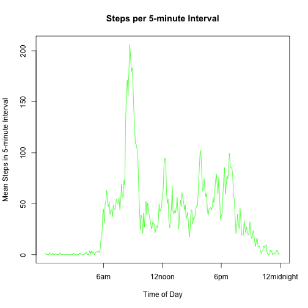
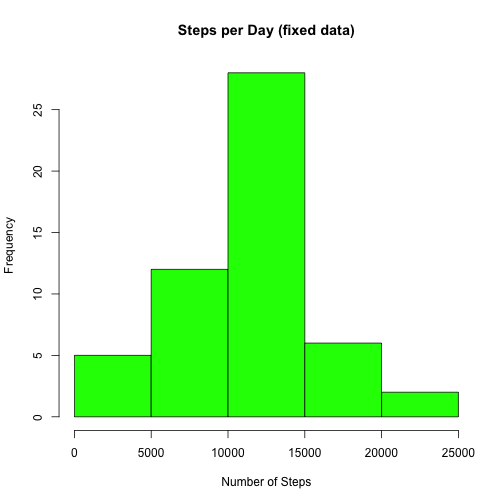
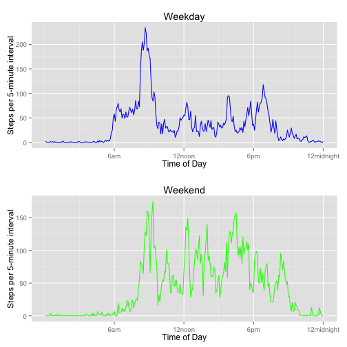

# Reproducible Research: Peer Assessment 1

## Loading and preprocessing the data

Assume the data zipfile, named "activity.zip", is in the current working directory.


```r
# load in the necessary packages
library(plyr)
library(ggplot2)
library(gridExtra)
```

```
## Loading required package: grid
```

```r
# Unzip the data file if that has not already been done
if (!file.exists("activity.csv")) {
  unzip("activity.zip")
  }
# read in the data
activity <- read.csv("activity.csv",colClasses=c("integer","POSIXct","integer"))
```


## What is mean total number of steps taken per day?

```r
steps_per_day <- ddply(activity, .(date), summarise, sum=sum(steps))
hist(steps_per_day$sum,main="Steps per Day",col="green",xlab= "Number of Steps")
```

 

Mean total number of steps per day:

```r
mean(steps_per_day$sum,na.rm=TRUE)
```

```
## [1] 10766
```

Median total number of steps per day:

```r
median(steps_per_day$sum,na.rm=TRUE)
```

```
## [1] 10765
```
## What is the average daily activity pattern?

```r
steps_per_interval <- ddply(activity, .(interval), summarise, 
                            mean=mean(steps,na.rm=TRUE))
steps_per_interval$rownum <- c(1:nrow(steps_per_interval))
plot(steps_per_interval$rownum, steps_per_interval$mean,main="Steps per 5-minute Interval",col="green",type="l",
     xlab="Time of Day",xaxt='n',ylab="Mean Steps in 5-minute Interval")
  
axis(1,labels=c("6am","12noon","6pm","12midnight"),
       at=c(72,144,216,288))
```

 


## Imputing missing values

Calculate the number of 5-minute intervals with a missing value(NA)

```r
nrow(activity) - sum(complete.cases(activity$steps))
```

```
## [1] 2304
```
Replace missing step count values with the average step count for that same time interval.


```r
# make a copy of the steps colum
activity$fixed_steps <- activity$steps
for (i in 1:nrow(activity))
  {
  if( is.na(activity$steps[i]))
    {
    interv <- activity$interval[i]
    #index into steps_per_interval = i/5 + 1
    ind <- as.integer(i/5) + 1
    activity$fixed_steps[i] <-as.integer(steps_per_interval$mean[ind])
    }
  }
```
Recalculate the average steps per day to see how it compares with the raw data

```r
fixed_steps_per_day <- ddply(activity, .(date), summarise, sum=sum(steps))
hist(fixed_steps_per_day$sum,main="Steps per Day (fixed data)",col="green",xlab= "Number of Steps")
```

 
The histogram of the corrected data lokks very much like the histogram of the raw data. The mean and median values of number of steps per day are identical to the values computed for the raw data.


Mean total number of steps per day:

```r
mean(fixed_steps_per_day$sum,na.rm=TRUE)
```

```
## [1] 10766
```

Median total number of steps per day:

```r
median(fixed_steps_per_day$sum,na.rm=TRUE)
```

```
## [1] 10765
```


## Are there differences in activity patterns between weekdays and weekends?


```r
# set up columns which indicate day of week and weekend/not
activity$dayofweek <- weekdays(activity$date)
activity$weekend <- (weekdays(as.Date(activity$date)) %in% c('Saturday','Sunday'))

#Recalulate the mean steps_per_interval grouped by weekend/weekday
we_steps_per_interval <- ddply(activity, .(interval,weekend), summarise, 
                            mean=mean(steps,na.rm=TRUE))
#Sort the data so all the weekend values are grouped together
we_steps_per_interval <-we_steps_per_interval[with(we_steps_per_interval,order(we_steps_per_interval$weekend)),]
we_steps_per_interval$rownum <- c(1:288,recursive=TRUE)

# split the data into weekday/weekend
wday <- we_steps_per_interval[1:288,]
wend <- we_steps_per_interval[289:576,]

# do the weekday plot
g1 <- qplot(wday$rownum,wday$mean, geom="line",color=I("blue"),
            main="Weekday",
            xlab="Time of Day",
            ylab="Steps per 5-minute interval")
p1 <- g1 + scale_x_continuous(labels=c("6am","12noon","6pm","12midnight"), 
            breaks=c(72,144,216,288)) 

# do the weekend plot
g2 <- qplot(wend$rownum,wend$mean, geom="line",color=I("green"),
            main="Weekend",
            xlab="Time of Day",
            ylab="Steps per 5-minute interval")
p2 <- g2 + scale_x_continuous(labels=c("6am","12noon","6pm","12midnight"), 
            breaks=c(72,144,216,288)) 

# arrange the plots as two rows, 1 column                      
grid.arrange(p1,p2 ,nrow=2)
```

 

This plot shows how the average activity level over the course of a 24 hour period differs between weekdays and weekends.
